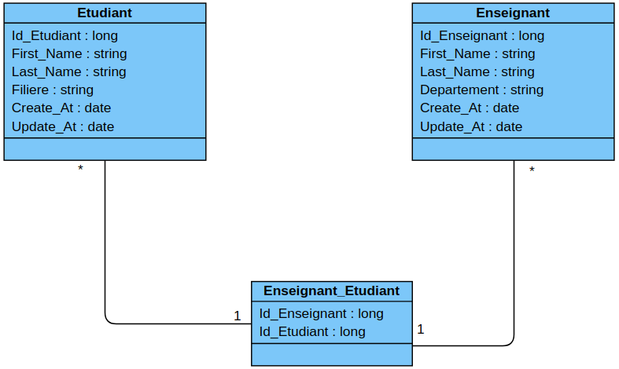

# TP final du module MDI
****Auteurs****

 **Oumar BALLO**
 
 **Roland KOUASSI**
 
 

### TP Backend (JPA) et Frontend (Vue.js)

## Fonctionnement de l'application

Notre application est une application servant à gerer des étudiants et des enseignants.
Elle permet donc d'enregistrer des étudiants ainsi que des enseignants. Lors de l'enregistrement 
d'un enseignant il est possible de selectionner un ou plusieurs étudiants qu'il doit enseigner.

Pour cela nous avons utilisé deux tables : Etudiants et Enseignants ayant une relation ManyToMany.
L'affichage des informations concernant un étudiant ou un enseignant se fait en cliquant sur le nom de
ce dernier. Lorsqu'on affiche les informations d'un enseignant, la liste des étudiants qu'il enseigne devrait 
s'afficher également mais cette partie est en développement.

le shema de notre modèle:

## Lancement de l'application

Pour lancer l'application, vous devez taper les commandes ci-dessous dans le répertoire racine du projet
Il faut également s'assurer que votre Docker local est en cours d'exécution.

- docker-compose up
- mvn clean spring-boot:run

Ensite ouvrez votre navigateur et vous pourrez acceder à l'application par :

- localhost:8000

